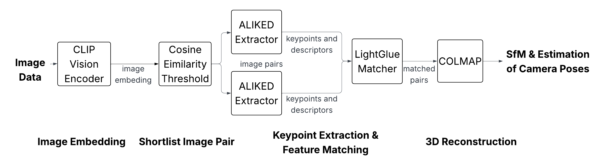
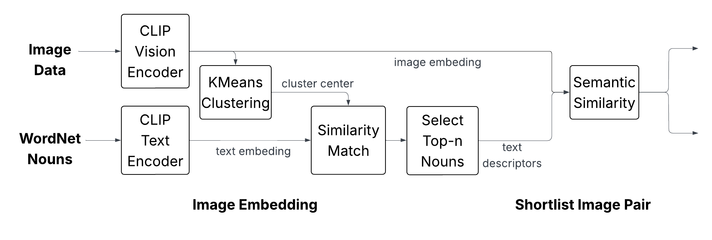
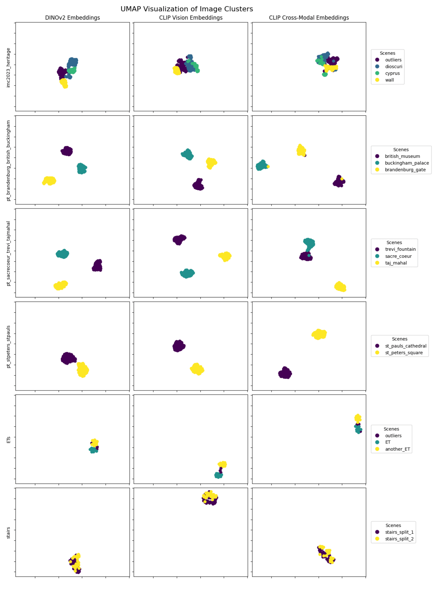
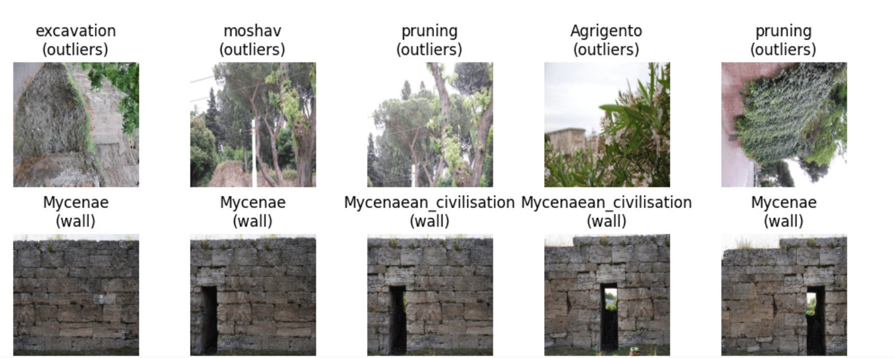
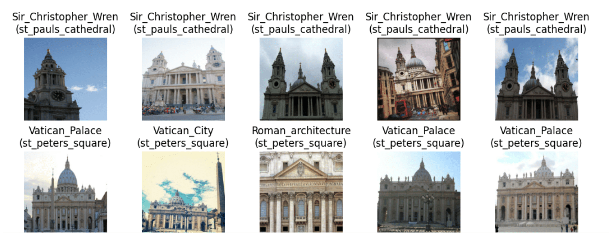
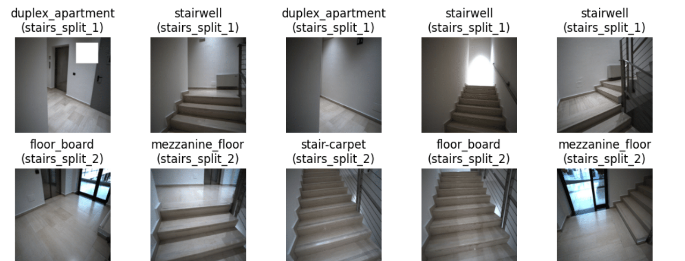

# COMP646: Deep Learning for Vision and Language  
## CLIP Cross-Modal Image Pairing for the Image Matching Challenge 2025
**Authors: Joshua Han and Alan Huang**
> To view more detail please read our [paper](Paper_CLIP_Cross_Modal_Image_Pairing_for_3D_Scene_Understanding.pdf) and [slides](Slides_CLIP Cross-Modal Image Pairing for 3D Scene Understanding.pdf)
This repository contains our final project for COMP646: Deep Learning for Vision and Language at Rice University. Our project is based on the [Image Matching Challenge 2025](https://www.image-matching-challenge.com/) organized by the Czech Technical University in Prague.

---

## 🏁 Competition Overview

The **Image Matching Challenge (IMC) 2025** tasks participants with developing algorithms that robustly estimate geometric correspondences between images of 3D scenes. These images can differ significantly in appearance due to lighting changes, occlusions, viewpoint shifts, and more. This year's competition focuses on reconstructing 3D scenes from a set of possibly related images.

> 📦 The dataset consists of 13 training scenes and 13 test scenes with accompanying evaluation scripts.

---

## 🧠 Our Approach

We explore **semantics-aware embedding** by leveraging **vision-language models** to enhance feature embeddings. Specifically, we compare three methods:

1. **DINOv2** (Self-supervised vision-only embeddings)
2. **CLIP Vision** (Image encoder from CLIP)
3. **CLIP Cross-Modal** (Image embeddings enhanced with top-matching text embeddings from WordNet nouns)

We introduce a **Text Counterpart Construction** pipeline proposed by [Li et al.](https://arxiv.org/pdf/2310.11989)
that selects noun-based semantic labels for clusters of image embeddings, then refines the image representations using text-guided supervision.

---

## 🔍 Visualizations

### UMAP Overview

Each row represents a dataset; each column a method. Points are colored by ground-truth scene labels. The CLIP Cross-Modal embeddings show the strongest scene separation in most cases.

### CLIP Cross-Modal Scene Labeling

We further visualize the top matching text counterparts for various datasets:

#### `imc2023_heritage`

#### `pt_stpeters_stpauls`

#### `stairs`

## How You Can Run

You can try out our method directly in Kaggle by copying our notebook:

▶️ [Run the notebook on Kaggle](https://www.kaggle.com/code/joshuajhan/vlm-clustering)
